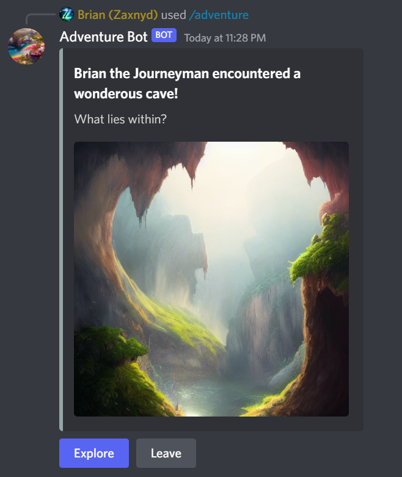
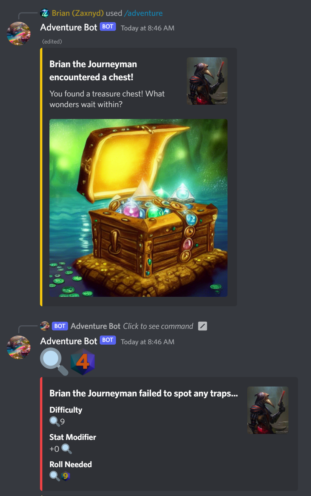
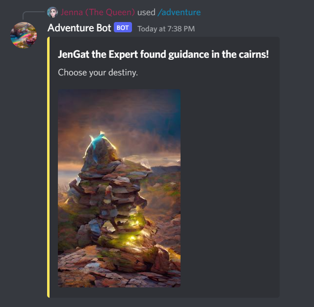
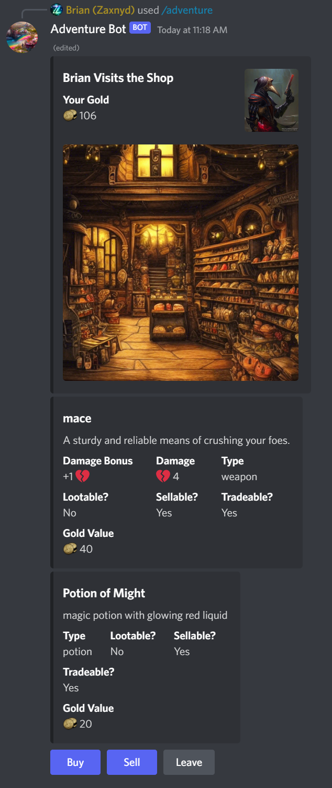
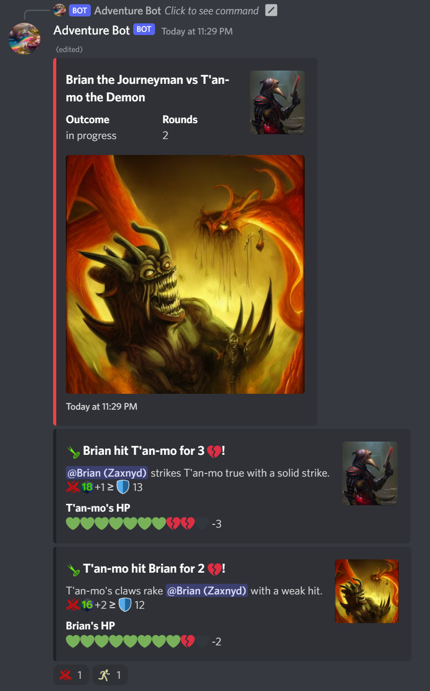
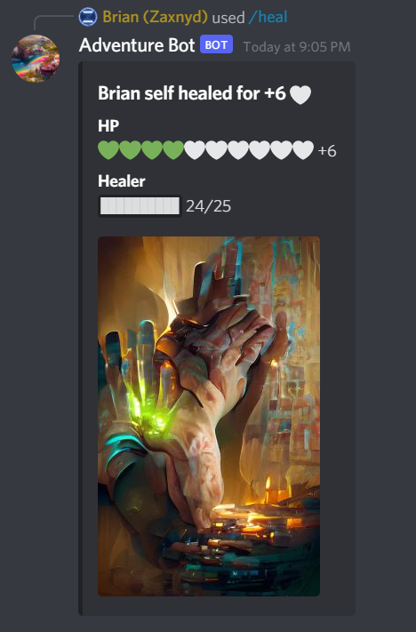
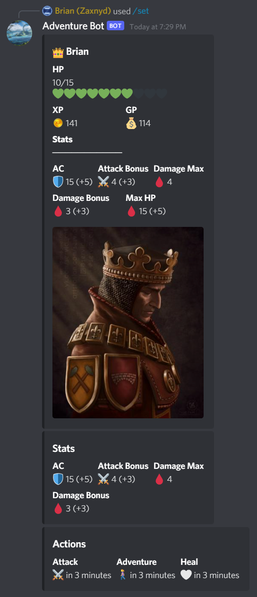
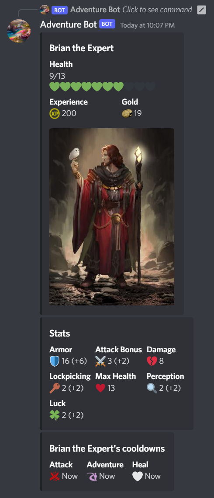

# Adventure Bot

Slay monsters, earn gold, evade traps, travel, gear up, complete quests, and stab your friends when they're at their weakest so you can steal all _their_ gold.

As you do.

Table of Contents:

- [Adventure Bot](#adventure-bot)
  - [Gameplay](#gameplay)
    - [Adventuring](#adventuring)
    - [Your Character](#your-character)
  - [Developers](#developers)

Adventure Bot is the DM in your friend's Discord roleplaying game!

Features:

- AI generated art (♥ [stable-diffusion](https://github.com/CompVis/stable-diffusion))
- Persistent monsters
- PvP gameplay
- Quests

## Gameplay

### Adventuring

Use `/adventure` to trigger a random encounter. It could be a fearsome enemy guarding valuable treasure, or a majestic shrine to grant you strength.

If you become injured, be sure to use `/heal` to restore your health.

### Your Character

Use `/inspect` to see your character's stats, inventory, and equipment.

Use it on another player with `/inspect <@user>` to see what they're carrying.

## Developers

Adventure Bot is developer friendly. Fork, hack, contribute!

See the [developer guide](developer-guide.md) to get started.
