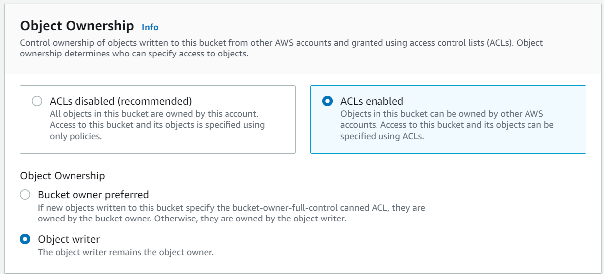
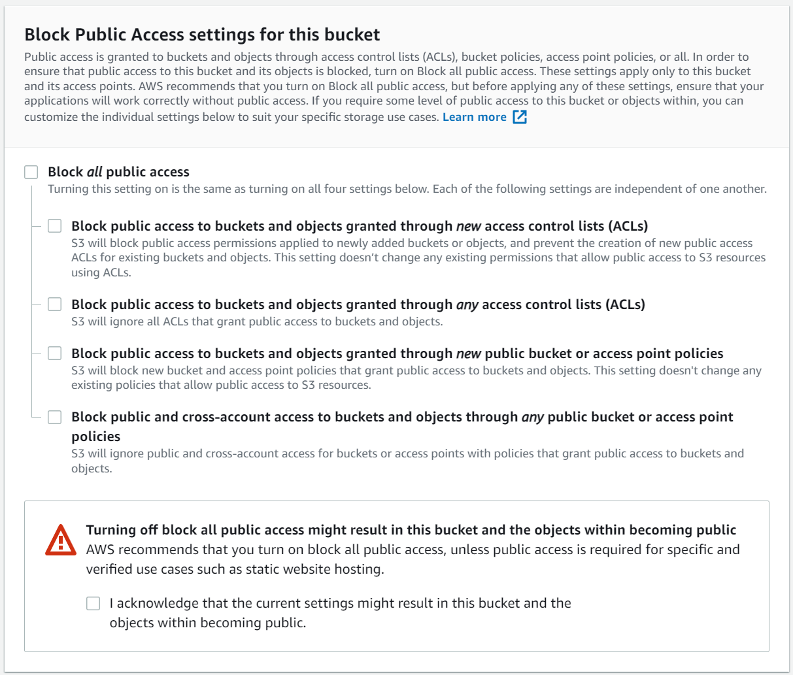

# Sync Assets
These assets will be used to generate a manifest as well as data to randomly select images.

Assets are stored in the following location: `images/s3/ai-gen/[theme]/[kind]/[entity]/<filename>.jpg`

# 1. Generate Assets
Generate your assets and store them in the appropriate folder. For example:

```sh
$ ai-art-gen -s fantasy -p "ghost" -n 5 -o ./images/s3/ai-gen/fantasy/characters
```

Once you have generated your assets, you can sync them to S3.

# 2. Syncing Assets to S3

## Create an S3 Bucket

Create your S3 bucket with ACLs and public access enabled.





Provide the following credentials in your `.env` file:
- `AWS_S3_HOST`=
- `AWS_S3_ASSETS_DIR`=./images/s3/ai-gen
- `AWS_S3_BUCKET`=
- `AWS_ACCESS_KEY_ID`=
- `AWS_SECRET_ACCESS_KEY`

[How do I get AWS_ACCESS_KEY_ID for Amazon?](https://stackoverflow.com/a/64325249/786729)

Once configuration is provided and you've created the bucket, you can sync assets via `yarn sync-s3-assets`.

# 3. Generating a Manifest
Once assets have been synced, an `asset-manifest.ts` file will be generated for use during runtime as well as build-time for Typescript Types.

# 4. Fetching assets
You may fetch assets in a variety of fashions, primarily through the use of `getAsset` helper.

```js
import { getAsset } from 'utils/getAsset'

const url = getAsset('fantasy', 'characters', 'ghost').s3Url()
```